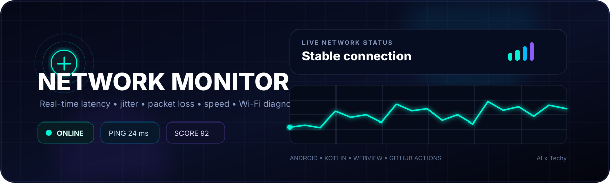

<div align="center">
  

  <h1>📡 Network Monitor</h1>

  <p><strong>A modern Android network diagnostics dashboard for measuring connection quality in real time.</strong></p>

  <p>
    
    
    
    
  </p>

  <p>
    
    
    
  </p>
</div>

---

## ⚡ What is Network Monitor?

**Network Monitor** is a lightweight Android application that turns network diagnostics into a live, visual dashboard.

It monitors more than simply whether the device is connected. The application is designed to expose useful measurements such as:

| Metric | What it tells you |
|---|---|
| ⚡ **Ping** | Round-trip network latency |
| 📊 **Jitter** | Variation between latency samples |
| 📦 **Packet Loss** | Percentage of failed requests |
| 🏆 **Connection Score** | A simplified quality indicator |
| 🚀 **Download Speed** | Measured downstream throughput |
| 📤 **Upload Speed** | Measured upstream throughput |
| 📶 **Wi-Fi Signal** | Signal strength in dBm when available |
| 🔗 **Link Speed** | Reported Wi-Fi connection rate |
| 📻 **Frequency** | Wi-Fi frequency information when available |
| 🌐 **Network Type** | Wi-Fi / mobile / other connection state |

> **Note:** Network measurements vary with the device, access point, ISP, routing, server, congestion and background traffic. Results are measurements of the current test conditions, not a guarantee of an ISP plan's advertised speed.

---

## 🧠 How it works

```text
┌────────────────────────────────────────────────────┐
│                  NETWORK MONITOR                   │
├────────────────────────────────────────────────────┤
│                                                    │
│  📡 Connectivity                                   │
│       │                                            │
│       ├── ⚡ Latency                               │
│       ├── 📊 Jitter                                │
│       ├── 📦 Packet Loss                           │
│       ├── 🚀 Download                             │
│       ├── 📤 Upload                               │
│       └── 📶 Wi-Fi diagnostics                    │
│                                                    │
├────────────────────────────────────────────────────┤
│                 Android Native Layer               │
│                    Kotlin                          │
├────────────────────────────────────────────────────┤
│                    WebView                         │
│               HTML / CSS / JS                     │
└────────────────────────────────────────────────────┘
```

The project uses a hybrid architecture:

- **Kotlin** handles Android-native capabilities.
- **WebView** renders the interactive dashboard.
- **JavaScript** handles the monitoring interface and visualizations.
- A **JavaScript ↔ Android bridge** exposes selected native network information to the web UI.
- **GitHub Actions** can build the debug APK without requiring Android Studio on the developer's machine.

---

## ✨ Features

### ⚡ Live latency monitoring

Network Monitor continuously samples a connectivity endpoint and keeps recent measurements for the dashboard.

```text
Sample → Sample → Sample → Sample → Sample
  24ms     22ms     26ms     25ms     23ms
                    │
                    ▼
              Live statistics
```

### 📊 Jitter

Jitter is estimated from the absolute differences between consecutive latency measurements:

```text
|Ping₂ − Ping₁|
|Ping₃ − Ping₂|
|Ping₄ − Ping₃|
        ↓
 Average variation
```

### 📦 Packet loss

Failed connectivity samples are tracked to estimate packet loss:

```text
Packet Loss = Lost Requests / Total Requests × 100
```

### 🏆 Connection score

The dashboard combines latency, jitter and packet-loss penalties into a simple 0–100 indicator.

```text
             100
              │
        Excellent
              │
              ├──── 80
              │
           Fair
              │
              ├──── 50
              │
           Poor
              │
              0
```

The score is an application-specific indicator, not an industry-standard rating.

---

## 🚀 Speed testing

The speed-test layer is designed around **actual data transfer**, rather than randomly generating a speed number.

A throughput measurement conceptually follows:

```text
Transferred Bytes × 8
───────────────────────
     Elapsed Seconds

          ↓

      bits / second
          ↓

        Mbps
```

For trustworthy results, speed testing should use enough transferred data and a suitable measurement window. Results can still differ substantially from an ISP's advertised rate because the entire network path matters.

### Example

```text
Download
██████████████████████░░  86 Mbps

Upload
███████████░░░░░░░░░░░░  42 Mbps

Latency                     24 ms
Jitter                       3 ms
Packet Loss                  0%
```

---

## 📶 Native Wi-Fi diagnostics

Where Android exposes the required information and permissions allow it, the application can read native network details such as:

```text
Wi-Fi
├── Signal:       -52 dBm
├── Link speed:    72 Mbps
├── Frequency:   2.4 GHz
└── Network type: Wi-Fi
```

Availability of individual fields depends on Android version, device manufacturer, permissions and the current connection.

---

## 🎨 UI philosophy

The interface follows a dark, futuristic monitoring-dashboard style:

- Glass-like cards
- Live status indicators
- Animated network pulse
- Real-time graphs
- Compact diagnostic cards
- Responsive WebView layout
- High-contrast metrics
- Minimal navigation

The goal is to make network information understandable at a glance without hiding the underlying measurements.

---

## 🏗️ Architecture

```text
                         ┌──────────────────────┐
                         │     Android App      │
                         │       Kotlin         │
                         └──────────┬───────────┘
                                    │
                           Android WebView
                                    │
                         JavaScript Interface
                                    │
                                    ▼
                 ┌─────────────────────────────────┐
                 │          Dashboard UI           │
                 │          HTML / CSS / JS        │
                 └──────────────┬──────────────────┘
                                │
              ┌─────────────────┼─────────────────┐
              ▼                 ▼                 ▼
          Monitoring        Speed Test        Wi-Fi Info
              │                 │                 │
              └─────────────────┴─────────────────┘
                                │
                                ▼
                         Live UI updates
```

### JavaScript bridge

Native Android functionality is exposed through the bridge used by the WebView, for example:

```javascript
if (window.AndroidNetwork) {
    // Call supported native network functions here.
}
```

The bridge exists inside the Android application. Opening the HTML directly in a normal browser does **not** provide the native Android bridge.

---

## 📁 Project structure

```text
NetworkMonitor/
│
├── .github/
│   └── workflows/
│       └── build-apk.yml
│
├── app/
│   ├── src/main/
│   │   ├── java/com/alx/networkmonitor/
│   │   │   └── MainActivity.kt
│   │   │
│   │   ├── assets/
│   │   │   └── index.html
│   │   │
│   │   ├── res/
│   │   └── AndroidManifest.xml
│   │
│   └── build.gradle.kts
│
├── build.gradle.kts
├── settings.gradle.kts
├── gradle.properties
├── gradlew
├── gradlew.bat
├── README.md
└── assets/
    └── network-monitor-header.svg
```

---

## 🛠️ Tech stack

| Technology | Role |
|---|---|
| **Kotlin** | Native Android layer |
| **Android SDK 35** | Android APIs |
| **WebView** | Dashboard container |
| **HTML5** | UI structure |
| **CSS3** | Styling and animation |
| **JavaScript** | Monitoring logic |
| **Gradle 8.9** | Build system |
| **JDK 17** | Build/runtime toolchain |
| **GitHub Actions** | Cloud APK builds |

---

## 📱 Requirements

### Build environment

- JDK 17
- Android SDK 35
- Build Tools 35.0.0
- Gradle 8.9
- Android Gradle Plugin compatible with the project

### Runtime

The project currently targets Android API 35 with a minimum SDK of 23.

```kotlin
compileSdk = 35
minSdk = 23
targetSdk = 35
```

---

## 🔨 Build locally

Clone the repository:

```bash
git clone https://github.com/ALxTechy/NetworkMonitor.git
cd NetworkMonitor
```

Build the debug APK:

```bash
chmod +x gradlew
./gradlew :app:assembleDebug
```

APK output:

```text
app/build/outputs/apk/debug/app-debug.apk
```

---

## 🤖 Build without Android Studio

The repository includes a GitHub Actions workflow.

```text
┌──────────────┐
│ Push / Run   │
│ GitHub Action│
└──────┬───────┘
       ▼
┌──────────────┐
│ JDK 17       │
├──────────────┤
│ Android SDK  │
├──────────────┤
│ Gradle 8.9   │
└──────┬───────┘
       ▼
┌──────────────┐
│ assembleDebug│
└──────┬───────┘
       ▼
┌──────────────┐
│ APK Artifact │
└──────────────┘
```

### Run from GitHub

1. Open the repository.
2. Open **Actions**.
3. Select **Build Android APK**.
4. Select **Run workflow**.
5. Wait for the workflow to finish.
6. Open the successful workflow run.
7. Find **Artifacts**.
8. Download `NetworkMonitor-debug-apk`.
9. Extract the ZIP.
10. Install `app-debug.apk` on your Android device.

---

## ⚙️ GitHub Actions workflow

The workflow provisions JDK 17, Android SDK 35 and Gradle 8.9, then builds and uploads the debug APK.

```yaml
name: Build Android APK

on:
  push:
    branches: ["main", "master"]
  workflow_dispatch:

permissions:
  contents: read

jobs:
  build:
    runs-on: ubuntu-latest

    steps:
      - name: Checkout
        uses: actions/checkout@v4

      - name: Set up JDK 17
        uses: actions/setup-java@v4
        with:
          distribution: temurin
          java-version: "17"

      - name: Set up Android SDK
        uses: android-actions/setup-android@v4
        with:
          packages: 'platform-tools'

      - name: Install Android SDK
        run: |
          sdkmanager "platforms;android-35" "build-tools;35.0.0"

      - name: Set up Gradle
        uses: gradle/actions/setup-gradle@v4
        with:
          gradle-version: "8.9"

      - name: Generate Gradle Wrapper
        run: |
          gradle wrapper --gradle-version 8.9
          chmod +x gradlew

      - name: Build APK
        run: |
          ./gradlew :app:assembleDebug --stacktrace --console=plain

      - name: Upload APK
        uses: actions/upload-artifact@v4
        with:
          name: NetworkMonitor-debug-apk
          path: app/build/outputs/apk/debug/app-debug.apk
          if-no-files-found: error
          retention-days: 30
```

---

## 🧪 Recommended testing

For more meaningful speed results, run several tests under similar conditions rather than trusting one measurement:

```text
Test 1   58 Mbps
Test 2   63 Mbps
Test 3   60 Mbps
Test 4   61 Mbps
Test 5   59 Mbps
              ↓
       Compare the samples
```

For Wi-Fi testing, keep the device in the same location and avoid simultaneous heavy downloads/uploads.

---

## ⚠️ Important measurement limitations

A network speed result is affected by the entire path:

```text
Phone
  ↓
Wi-Fi / Mobile Radio
  ↓
Router / Cell Tower
  ↓
ISP
  ↓
Internet Routing
  ↓
Test Server
```

So a **100 Mbps plan does not mean every application will always measure exactly 100 Mbps**.

Potential sources of variation include:

- Wi-Fi interference
- Signal strength
- Router load
- Other devices using the network
- ISP congestion
- Test-server capacity
- Server distance
- VPN/proxy usage
- Background traffic
- Device limitations
- Measurement duration

---

## 🔐 Privacy

Network Monitor is intended to operate without an account or user profile.

The application may contact external endpoints while performing network tests. These endpoints are necessary for connectivity and throughput measurements.

Do not use the application in an environment where network-test traffic is prohibited.

---

## 🗺️ Roadmap

### Stage 1 — Core monitoring

- [x] Ping monitoring
- [x] Average latency
- [x] Jitter
- [x] Packet loss
- [x] Connection score
- [x] Start / Stop monitoring
- [x] Live graph

### Stage 2 — Android integration

- [x] Android WebView
- [x] Native Android bridge
- [x] Wi-Fi information
- [x] Network type detection
- [x] Speed-test foundation
- [x] GitHub Actions APK build

### Stage 3 — Advanced diagnostics

- [ ] More robust throughput testing
- [ ] Multiple test servers
- [ ] Test history
- [ ] Historical graphs
- [ ] Background monitoring
- [ ] Connection-change detection
- [ ] Notification support
- [ ] Export to CSV
- [ ] Export to JSON
- [ ] Advanced diagnostics
- [ ] DNS latency testing
- [ ] Gateway information
- [ ] Connectivity diagnostics

---

## 🖼️ Screenshots

Create an `assets/screenshots/` folder and add your real screenshots:

```text
assets/
└── screenshots/
    ├── dashboard.png
    ├── monitoring.png
    ├── speed-test.png
    └── wifi-info.png
```

Then use:

```html
<p align="center">
  
  
  
</p>
```

---

## 🤝 Contributing

Contributions, bug reports and feature ideas are welcome.

```bash
git checkout -b feature/my-feature
git add .
git commit -m "Add my feature"
git push origin feature/my-feature
```

Then open a Pull Request.

### Bug reports should include

```text
Device:
Android version:
App version:
Network type:
Steps to reproduce:
Expected result:
Actual result:
Screenshots:
Relevant logs:
```

---

## 📜 License

This project is released under the **MIT License**.

See `LICENSE` for details.

---

<div align="center">

  <h2>📡 Monitor. Measure. Understand.</h2>

  <p>Built with Kotlin, WebView, JavaScript and GitHub Actions.</p>

  <p>
    <strong>ALx Techy</strong>
  </p>

  <p>
    ⭐ Star the repository if you find it useful · 🐛 Report bugs · 💡 Suggest features
  </p>

</div>
